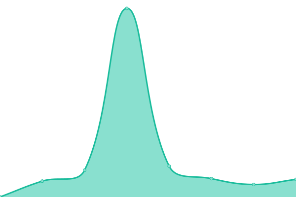

# [📈 Live Status](https://upptime.github.io/upptime): <!--live status--> **🟧 Partial outage**

This repository contains the open-source uptime monitor and status page for [Upptime](https://upptime.js.org), powered by [Upptime](https://github.com/upptime/upptime).

With [Upptime](https://upptime.js.org), you can get your own unlimited and free uptime monitor and status page, powered entirely by a GitHub repository. We use [Issues](https://github.com/upptime/upptime/issues) as incident reports, [Actions](https://github.com/empreendercacb/monitor/actions) as uptime monitors, and [Pages](https://upptime.github.io/upptime) for the status page.

<!--start: status pages-->
<!-- This summary is generated by Upptime (https://github.com/upptime/upptime) -->
<!-- Do not edit this manually, your changes will be overwritten -->
<!-- prettier-ignore -->
| URL | Status | History | Response Time | Uptime |
| --- | ------ | ------- | ------------- | ------ |
|  [Portal Empreender - Produção](https://www.empreender.org.br/sistema/) | 🟩 Up | [portal-empreender-producao.yml](https://github.com/empreendercacb/monitor/commits/HEAD/history/portal-empreender-producao.yml) | 

 801ms
     
 | 

<a href="https://empreendercacb.github.io/monitor/history/portal-empreender-producao">100.00%</a>
    

|  [Ensino CACB](http://ensinocacb.org.br) | 🟥 Down | [ensino-cacb.yml](https://github.com/empreendercacb/monitor/commits/HEAD/history/ensino-cacb.yml) | 

 1772ms
     
 | 

<a href="https://empreendercacb.github.io/monitor/history/ensino-cacb">99.54%</a>
    

|  [Portal Empreender - Teste](https://teste.cacbempreenderapp.org.br/sistema) | 🟩 Up | [portal-empreender-teste.yml](https://github.com/empreendercacb/monitor/commits/HEAD/history/portal-empreender-teste.yml) | 

 305ms
     
 | 

<a href="https://empreendercacb.github.io/monitor/history/portal-empreender-teste">100.00%</a>
    

|  [Portal Empreender - Teste Beta](http://beta.cacbempreenderapp.org.br/) | 🟩 Up | [portal-empreender-teste-beta.yml](https://github.com/empreendercacb/monitor/commits/HEAD/history/portal-empreender-teste-beta.yml) | 

 460ms
     
 | 

<a href="https://empreendercacb.github.io/monitor/history/portal-empreender-teste-beta">100.00%</a>
    

|  [API V5 - Teste Beta](https://api.cacbempreenderapp.org.br/) | 🟩 Up | [api-v5-teste-beta.yml](https://github.com/empreendercacb/monitor/commits/HEAD/history/api-v5-teste-beta.yml) | 

 191ms
     
 | 

<a href="https://empreendercacb.github.io/monitor/history/api-v5-teste-beta">100.00%</a>
    

<!--end: status pages-->

[**Visit our status website →**](https://upptime.github.io/upptime)

## 📄 License

- Powered by: [Upptime](https://github.com/upptime/upptime)
- Code: [MIT](./LICENSE) © [Upptime](https://upptime.js.org)
- Data in the `./history` directory: [Open Database License](https://opendatacommons.org/licenses/odbl/1-0/)
